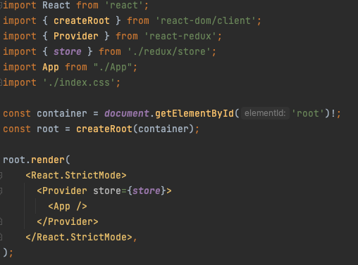

# Login-SignUp form with react, redux and typescript

This project contain a login and sigUp form. Is build using:
- React
- Redux
- Typescript
- Testing Library
- EsLint

## Set up

Create a new React app with Typescript support:

`npx create-react-app login-signUp-form --template typescript`

Then cd into the login-signUp-form folder:

`cd login-signUp-form`

I’ve seen some cases where the react and react-dom typescript type definitions aren’t automatically installed as part of create react app, resulting an error such as: Could not find a declaration file for module 'react', so to be on the safe side, install them now:

`npm install @types/react @types/react-dom`

Add the Redux Toolkit and React-Redux packages to your project:

`npm install @reduxjs/toolkit react-redux`

Now, install Tailwind CSS and its related dependencies by running the following command:

`npm install -D tailwindcss postcss autoprefixer`

Next, generate some configurational files by running the following command in the root directory:

`npx tailwindcss init -p`

That should generate a tailwind.config.js file and postcss.config.js file.

Now, go ahead and update the tailwind.config.js file to support templates for your React component files as shown:

Almost there! We'll now add some necessary Tailwind directives to your index.css file present in the root directory:

Each of the above directives represents a layer of Tailwind's utility classes that you can use in your project. Their declaration allows using these utility classes anywhere in your project.

Finally, we'll kickstart your React project by spinning a local development server:

`npm start`

## Frontend Architecture and Boilerplate

Delete all the boilerplate. We'll add everything we need from scratch instead. 

`cd src && rm *` # move to src and delete all files within

We'll make directories for redux, as well as pages, components and utils.

`mkdir redux components pages utils`

And we'll bring back index.tsx, App.tsx and index.css (we copy and paste what we had before).

`touch index.tsx index.css App.tsx`

So at this point your project directory tree looks like this.

## Setting up the Redux Store

When I first started learning Redux, it seemed so overwhelming because every app I looked at had index and store set up a bit differently.
After watching several tutorials and trying different ways to do it, this is the one that has worked for me.

Create a file named src/redux/store.tsx. Import the configureStore API from Redux Toolkit. We'll start by creating an empty Redux store, and exporting it:

In index.tsx, we'll be bringing in a few things.

* createStore, to create the store that will maintain the Redux state
* Provider, to wrap the entire application in Redux

